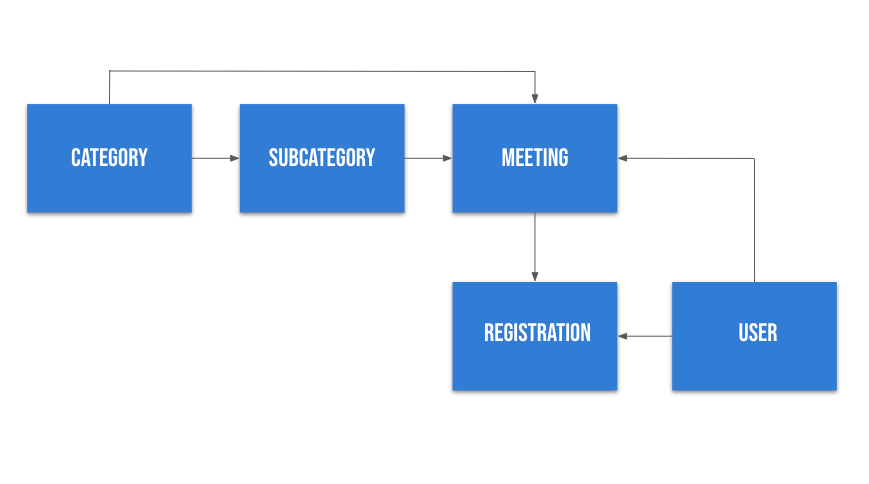

# Coterie

<<<<<<< HEAD
Coterie is a web application that allows users to host and join virtual meetings to connect people with shared interests.
The inspiration of this app came during the time of COVID where it was difficult for people to gather in-person. Coterie provides a safe space to still meet new people and stay connected.
The word *Coterie*  means a small group of people with shared interests or tastes.
=======
Coterie is a web application that allows users to join and host virtual meetings to connect people with shared interests. The inspiration of this app came during the time of [COVID-19](https://www.cdc.gov/coronavirus/2019-ncov/index.html) where it's been difficult for people to gather in-person. Coterie provides a safe space to stay connected and continue to meet new people.
The definition of *Coterie* is a small group of people with shared interests or tastes.
>>>>>>> 3313225c6c3836ed0fdd6754fc8a7c9aea87be83

Check out Waverley's [Medium article](https://medium.com/swlh/letting-the-user-select-a-subcategory-based-on-its-category-in-a-form-bc786e598dd4) on how she debugged for a form, letting the user select a subcategory based on its category

[Link to video demo](https://youtu.be/FBEOMOhLc54)

## Getting started
1. Clone down this repo onto your local machine --git clone
2. cd into 'Coterie' application
3. Run ```bundle install``` to install all required dependencies
4. Run ```rails db:migrate``` to set up the tables for the database
5. Run ```rails db:seed``` load data
6. Run ```rails s``` to start the server
7. Open the browser and go to 'http://localhost:3000/' to start the app!

## User Features

### Password Authentication
 * Validate current users and keeps them logged in using sessions
 * Authenticate users' passwords with BCrypt

### CRUD Operations
 Users (the Attendee) can:
  * log into the application
  * create an account
  * see an error message if their account input is wrong
  * register for a meeting
  * view their meetings
  * browse available meetings

 User (the Host) can:
  * log into the application
  * create a meeting
  * change their meetings
  * cancel the meeting

### Active Record Associations
 * There are 5 models that have the following associations ```has_many```, ```belongs_to``` and ```has_many, through: ```

## Domain Model
 </img>
 
## Tech Stack
 * Ruby on Rails
 * PostgreSQL
 * HTML/CSS
 * Active Record

## Tools
 * Bootstrap
 * BCrypt
 * Custom CSS

## Build Status
<<<<<<< HEAD
 * This project was completed in 5 days for the purpose of the project presentation.
=======
 * This project was completed in 6 days for the purpose of the project presentation.
>>>>>>> 3313225c6c3836ed0fdd6754fc8a7c9aea87be83

## Future Features
 * Improve design elements (look of buttons, background image, text manipulation)
 * Create a logo
 * Add About page
 * Utilize API/CSV file for welcome page
 * If a user is a host they can’t be an attendee
 * Allow users to upload a profile picture
 * Add attribute to meeting for url

## Contributors
 * [Anna Kim](https://github.com/iannakim)
 * [Waverley Leung](https://github.com/wlcreate)
 * [Ekaterina Zarudnaya](https://github.com/Elronia)
 
<<<<<<< HEAD

=======
## Acknowledgements
 We would like to thank:
  * Sylwia Vargas
  * Eric Kim
  * Annie Zheng
  * Isabel K. Lee
  * the Code Bender Cohort
>>>>>>> 3313225c6c3836ed0fdd6754fc8a7c9aea87be83
